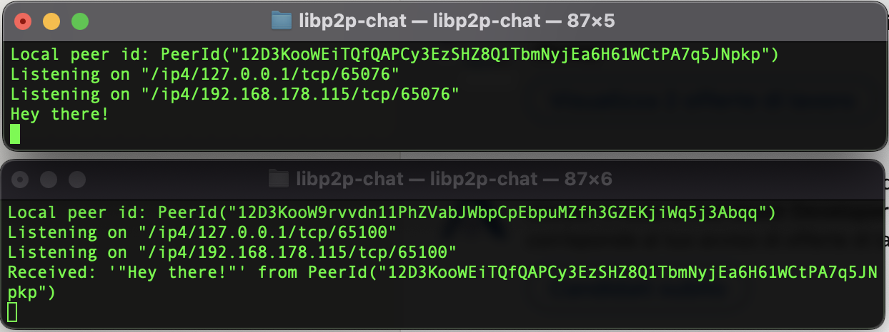

# libp2p-chat
Basic terminal chat based on [rust-libp2p](https://github.com/libp2p/rust-libp2p).

## Run the chat

Run this command in 2 different terminals
```bash
cargo run
```




## Troubleshooting
If cargo complains about `protobuf`, ensure you have it in your `PATH`.

Install it otherwise:

```bash
# e.g. on MacOS
brew install protobuf
```